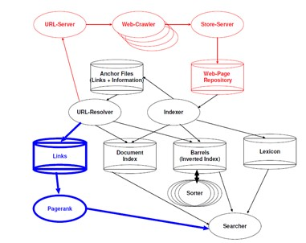

# Relevante Objekte empfehlen

F: _Nennen und erklären Sie die Funktionalität der drei Hauptkomponenten einer Suchmaschine wie Google_ \(9 Punkte\)

A:

Nach Brin and Page \(1998 S. 3828\):

1. **Komponenten zum Crawling**: Der URL-Server schickt eine Liste mit zu suchenden Webseiten an die Crawler. Verteilte Crawler laden Webseiten herunter. Der Store-Server komprimiert die Webseiten und legt sie im Webpage-Repository mit einer doc id ab.
2. **Komponenten zum Indexieren von Daten**: Der Indexer liest das Repository, dekomprimiert die Webseiten und extrahiert aus den Webseiten Wort-Treffer mit Informationen zu Schriftgröße, Großschreibung etc. \(hits\) und speichert sie in den _barrels_ ab. Weiterhin werden alle Links extrahiert und Linkziel, der Linktext und die Linkquelle in _Anchors Files_ gespeichert. Der URL-Resolver liest die Anchor Files, konvertiert die Links in absolute Links und generiert doc Ids. Die Anchor-Texts werden ebenfalls mit abgelegt im Forward Index. Der Sorter sortiert die Barrels nach wordIDs, um einen invertierten Index zu erstellen. Weiterhin besteht ein Lexikon, das neu aus dem Indexer generiert wird. Es wird dann vom _Searcher_ verwendet, um mit dem invertierten Index und PageRank Suchanfragen zu beantworten.
3. **Komponenten zum Bewerten der Wichtigkeit**: Anhand der Links wird eine Link-Datenbank aufgebaut, woraus dann der Page-Rank für alle Dokumente ermittelt wird \(vgl. The anatomy of a large-scale hypertext\).



F: _Wie wird die Gewichtungsmatrix von PageRank aus der Adjazenzmatrix aufgebaut? Erklären Sie die PageRank Formel für die Gewichtungsmatrix_ \(9 Punkte\)

A: Die PageRank Formel lautet wie folgt:

$$
M = \left( 1 - m \right) \times A + m \times S
$$

ist dabei die Matrix, die aus der Linkstruktur abgeleitet wird. Sie enthält **Stimmenverteilung**. Die Matrix {%A enthält in einer Zeile k, die Stimmanteile, die k von anderen Seiten erhält. Und in Spalte

, die Stimmanteile, die

an die anderen Spalten verteilt \(Folie 11 + 18\). Die positiven Werte in Spalte k stellen die Wahrscheinlichkeit dar, dass ein Surfer von Seite k auf eine Seite

durch Anklicken des Links zwischen

und

wechselt. \(Folie 19\)

Die Matrix S ist eine

Matrix mit

. Sie enthält **Gleichverteilung**. Die Annahme ist, dass ein Surfer z. B. durch Eingeben eines Links in den Browser auf irgendeine Seite wechselt. Die Wahrscheinlichkeit von

nach

zu wechseln ist damit

. \(Folie 19\)

Der Faktor

gewichtet also den Einfluss beider Verhaltensmodi \(zufälliges Klicken vs. Weiternavigieren in Linkstruktur\) des Random Surfers. \(Folie 19\). Behebt damit das Problem nicht verbundener Nodes, Dangling Nodes \(und Spidertraps\).

F: Wie wird der PageRank Index aus der Gewichtungsmatrix berechnet? Beschreiben Sie den Berechnungsalgorithmus \(6 Punkte\)

A: Es wird die Power-Methode verwendet:

```text
Power(M, z, k)
M: PageRank Linkmatrix
z: Startvektor aus n Einsen (x_j = 1)
k: Anzahl der Iterationen
x <- z;
For i in 1 to k
    Do x <- Mx;
Return(x)
```

**Erklärung**:

Der Vektor

wird mit

initialisiert. Es wird

$-fach eine Matix {%M von links an den Vektor

multipliziert. Das Ergebnis des Matrix-Vektorprodukts wird in

gespeichert. Aus

lässt sich nach

Iterationen der Index ableiten.

## Quellen:

Brin, Sergey, and Lawrence Page. 1998. “The Anatomy of a Large-Scale Hypertextual Web Search Engine.” _Computer Networks and ISDN Systems_ 30 \(1-7\): 107–17. [https://doi.org/10.1016/S0169-7552\(98\)00110-X](https://doi.org/10.1016/S0169-7552%2898%2900110-X).

